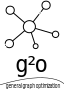

# g2o - General Graph Optimization

Linux/Mac: [](https://github.com/RainerKuemmerle/g2o/actions/workflows/ci.yml)
Windows: [](https://github.com/RainerKuemmerle/g2o/actions/workflows/windows.yml)
[](https://app.codacy.com/gh/RainerKuemmerle/g2o/dashboard?utm_source=gh&utm_medium=referral&utm_content=&utm_campaign=Badge_grade) [](https://github.com/pre-commit/pre-commit)

<p align="center">
  <picture>
    <source media="(prefers-color-scheme: dark)" width="250" srcset="doc/pics/g2o-logo-dark.svg">
    <source media="(prefers-color-scheme: light)" width="250" srcset="doc/pics/g2o-logo.svg">
    
  </picture>
</p>

g2o is an open-source C++ framework for optimizing graph-based nonlinear error
functions. g2o has been designed to be easily extensible to a wide range of
problems and a new problem typically can be specified in a few lines of code.
The current implementation provides solutions to several variants of SLAM and
BA.

A wide range of problems in robotics as well as in computer-vision involve the
minimization of a non-linear error function that can be represented as a graph.
Typical instances are simultaneous localization and mapping (SLAM) or bundle
adjustment (BA). The overall goal in these problems is to find the
configuration of parameters or state variables that maximally explain a set of
measurements affected by Gaussian noise. g2o is an open-source C++ framework
for such nonlinear least squares problems. g2o has been designed to be easily
extensible to a wide range of problems and a new problem typically can be
specified in a few lines of code. The current implementation provides solutions
to several variants of SLAM and BA. g2o offers a performance comparable to
implementations of state-of-the-art approaches for the specific problems
(02/2011).

## Python and updated memory management

The branch [pymem](https://github.com/RainerKuemmerle/g2o/tree/pymem) contains a python wrapper and switches to smart pointer instead of RAW pointers.
It is currently experimental but PRs and improvements are welcome - as always.

See [g2o-python](https://github.com/miquelmassot/g2o-python) for the pypi release of g2o's python bindings.

## Papers Describing the Approach

Rainer Kuemmerle, Giorgio Grisetti, Hauke Strasdat,
Kurt Konolige, and Wolfram Burgard
[g2o: A General Framework for Graph Optimization](http://ais.informatik.uni-freiburg.de/publications/papers/kuemmerle11icra.pdf)
IEEE International Conference on Robotics and Automation (ICRA), 2011

## Documentation

A detailed description of how the library is structured and how to use and extend it can be found in /doc/g2o.pdf
The API documentation can be generated as described in doc/doxygen/readme.txt

## License

g2o is licensed under the BSD License. However, some libraries are available
under different license terms. See below.

The following parts are licensed under LGPL v2.1+:

-   csparse_extension

The following parts are licensed under GPL3+:

-   g2o_viewer
-   g2o_incremental
-   slam2d_g2o (example for 2D SLAM with a QGLviewer GUI)

Please note that some features of CHOLMOD (which may be used by g2o, see
libsuitesparse below) are licensed under the GPL. To avoid the GPL, you may
have to re-compile CHOLMOD without including its GPL features. The CHOLMOD
library distributed with, for example, Ubuntu or Debian includes the GPL
features. For example, the supernodal factorization that is licensed under GPL
is considered by g2o if it is available.

Within sub-folders we include software not written by us to guarantee easy compilation and integration into g2o itself.

-   ceres: BSD (see g2o/autodiff/LICENSE)
    Extracted headers to perform Automatic Differentiation.

-   freeglut: X-Consortium (see g2o/EXTERNAL/freeglut/COPYING)
    Copyright (c) 1999-2000 Pawel W. Olszta
    We use a stripped down version for drawing text in OpenGL.

See the doc folder for the full text of the licenses.

g2o is distributed in the hope that it will be useful,
but WITHOUT ANY WARRANTY; without even the implied warranty of
MERCHANTABILITY or FITNESS FOR A PARTICULAR PURPOSE. See the
licenses for more details.

## Requirements

-   C++17 compiler (CI pipeline runs with gcc, clang and MSVC)
-   cmake <http://www.cmake.org>
-   Eigen3 <http://eigen.tuxfamily.org>

On Ubuntu / Debian these dependencies are resolved by installing the
following packages.

-   cmake
-   libeigen3-dev

### Optional requirements

-   spdlog <https://github.com/gabime/spdlog>
-   suitesparse <http://faculty.cse.tamu.edu/davis/suitesparse.html>
-   Qt5 <http://qt-project.org>
-   libQGLViewer <http://www.libqglviewer.com>

On Ubuntu / Debian these dependencies are resolved by installing the
following packages.

-   libspdlog-dev
-   libsuitesparse-dev
-   qtdeclarative5-dev
-   qt5-qmake
-   libqglviewer-dev-qt5

You can install those packages with the following command
```
sudo apt install libeigen3-dev libspdlog-dev libsuitesparse-dev qtdeclarative5-dev qt5-qmake libqglviewer-dev-qt5
```

## Mac OS X

If using [Homebrew](http://brew.sh/), then

`brew install g2o`

will install g2o together with its required dependencies. In this case no manual compilation is necessary.

## Windows

If using [vcpkg](https://github.com/Microsoft/vcpkg), then

`script\install-deps-windows.bat`

or for full dependencies installation

`script\install-additional-deps-windows.bat`

will build and install the dependencies. The location of `vcpkg` and required
triplet can be passed as cli arguments respectively. Note that usually vcpkg
will auto detect the triplet. Set it only if your are not using the default
build for your OS.

## Compilation

Our primary development platform is Linux. Experimental support for
Mac OS X, Android and Windows (MinGW or MSVC).
We recommend a so-called out of source build which can be achieved
by the following command sequence.

```
mkdir build
cd build
cmake ../
make
```

The binaries will be placed in bin and the libraries in lib which
are both located underneath cmake's build folder.

On Windows with `vcpkg` the following commands will generate build scripts (please change the Visual Studio version number in accordance with your system):

```
mkdir build
cd build
cmake -DG2O_BUILD_APPS=ON -DG2O_BUILD_EXAMPLES=ON-DVCPKG_TARGET_TRIPLET="%VCPKG_DEFAULT_TRIPLET%" -DCMAKE_TOOLCHAIN_FILE="%VCPKG_ROOT_DIR%\scripts\buildsystems\vcpkg.cmake" ..`
cmake --build . --target ALL_BUILD
```

If you are compiling on Windows and you are for some reasons **not** using `vcpkg` please download Eigen3 and extract it.
Within cmake-gui set the variable EIGEN3_INCLUDE_DIR to that directory.

```
mkdir build
cd build
cmake .. -DG2O_BUILD_APPS=ON -DG2O_BUILD_EXAMPLES=ON -DEIGEN3_INCLUDE_DIR="<THE_PATH_WHERE_YOU_PLACED_EIGEN3_AND_THE_EIGEN3_CMakeLists.txt>"
```

## Cross-Compiling for Android

```
mkdir build`
cd build`
cmake -DCMAKE_TOOLCHAIN_FILE=../script/android.toolchain.cmake -DANDROID_NDK=<YOUR_PATH_TO_ANDROID_NDK_r10d+> -DCMAKE_BUILD_TYPE=Release -DANDROID_ABI="armeabi-v7a with NEON" -DEIGEN3_INCLUDE_DIR="<YOUR_PATH_TO_EIGEN>" -DEIGEN3_VERSION_OK=ON ..
cmake --build .
```

## Acknowledgments

We thank the following contributors for providing patches:

-   Simon J. Julier: patches to achieve compatibility with Mac OS X and others.
-   Michael A. Eriksen for submitting patches to compile with MSVC.
-   Mark Pupilli for submitting patches to compile with MSVC.

## Projects using g2o

-   [g2o-python](https://github.com/miquelmassot/g2o-python): Python binding which is also installable via `pip`
-   [.Net wrapper](https://github.com/fugro/g2o)
